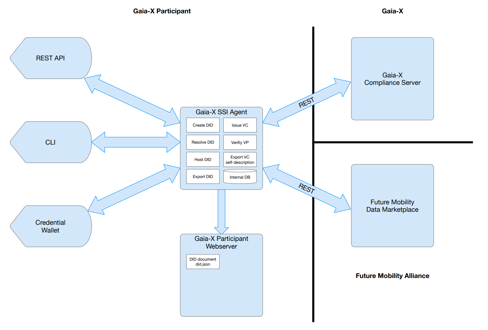

<!--suppress HtmlDeprecatedAttribute -->
<h1 align="center">
  <br>
  <a href="https://www.sphereon.com"></a>
  <br>Gaia-X Agent 
  <br>
</h1>

---

__Warning: These packages are in a very early development stage. Breaking changes without notice will occur at this
point!__

---

# Gaia-X agent
The Gaia-X agent is an agent that can create Verifiable Credentials and Presentations out of Gaia-X self-descriptions. It can submit these to the Gaia-X Compliance Server, to get back Compliance Credentials. The agent can also issue and verify generic Verifiable Credentials and Presentations.
Lastly the agent can export well-known resources, like DID:web and X.509 Certificate chains needed in a Gaia-X context.

# Multiple scenario's
The Agent can be deployed and used in multiple scenarios:

- As a [Command Line tool (CLI)](./packages/gx-compliance-client-cli/README.md)
- As a REST API
- Directly integrated into a typescript and/or React-Native project



If you quickly want to test out the agent features, we suggest the [CLI](./packages/gx-compliance-client-cli/README.md)

# Developers

This is mono repository, with packages that handle steps for creating Gaia-X compliant Entities like self-descriptions compatible with [Veramo](https://veramo.io) modules.

This mono repo has the following packages:
- compliance-client
  - an agent managing GX credentials, presentations and compliance service
- compliance-cli
  - CLI support for the agent

## Building and testing

### Lerna

This package makes use of Lerna for managing multiple packages. Lerna is a tool that optimizes the workflow around managing multi-package repositories with git and npm / yarn.

### Build

The below command builds all packages for you using lerna

```shell
yarn build
```

### Test

The test command runs:

* `jest`
* `coverage`

You can also run only a single section of these tests, using for example `yarn test:watch`.

```shell
yarn test
```

### Utility scripts

There are other utility scripts that help with development.

* `yarn prettier` - runs `prettier` to fix code style.

### Publish

There are scripts that can publish the following versions:

* `latest`
* `next`
* `unstable`

```shell
yarn publish:[version]
```
