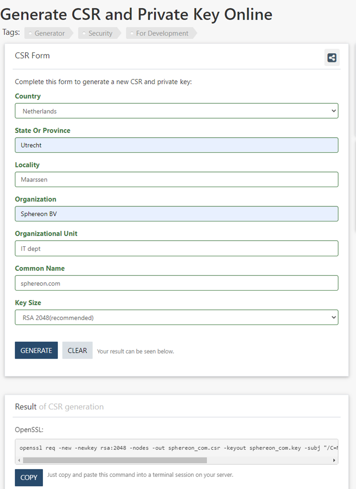

# X.509 - SSL Certificate Creation

In case the organization that wants to participate in the Future Mobility Alliance does not have an SSL certificate with
access to the private key yet, then the first thing to do would be to either purchase a certificate or using for
instance let’s encrypt to get one for free. Do not request or create a new certificate if an existing certificate is
already present for a particular domain. If this is the case there are 2 options:

- Acquire the private and public keys/certificates from the existing certificate
- Create a subdomain eg. ‘subdomain.example.com’, that you will use for the certificate. Creating (sub)domains is out of
  scope for this guide.

If you do have an existing certificate you can skip this whole document.

When creating a new Certificate there are 2 options currently.

- Create a Certificate Signing Request yourself and purchase a certificate with any party providing SSL certificate.
- Generate a certificate using Letsencrypt

## Create a CSR and purchase a certificate

The first step is creating the private key together with a Certificate Signing Request (CSR). This CSR is sent to the
Certificate Authority, allowing them to create the public Certificate part belonging to the private key you are
generating.

### Install OpenSSL on your computer

<Install instructions here>

### Certificate Signing Request (CSR)

The first step is creating the private key together with CSR. This CSR is sent to the Certificate Authority, allowing
them to create the public Certificate part belonging to the private key you are generating.
You can create the CSR by hand using openssl. A handy website to create the openssl command
is https://wtools.io/generate-csr-and-private-key
You can simply fill out the form with your organization information. The important bit to know is that the “Common Name”
should equal the Internet Domain Name for your organization, or a subdomain where you will be hosting files related to
GAIA-X in the future.
Warning: Do not use the generated CSR and private key from that website. Only copy the openssl command and run that
locally to generate a CSR and private key. As the name implies a private key should never be shared, and by simply using
the generated version of the CSR/private key the company owning that form tool, would potentially have access to that
private key. The openssl command ensures that everything is generated locally on your computer!



### Generate the CSR and private key with OpenSSL

The above example resulted in the following command to be ran locally:

````shell
openssl req -new -newkey rsa:2048 -nodes -out sphereon_com.csr -keyout sphereon_com.key -subj "/C=NL/ST=Utrecht/L=Maarssen/O=Sphereon BV/OU=IT dept/CN=sphereon.com"
````

This results in 2 files, sphereon_com.csr and sphereon_com.key respectively. The first file is the Certificate Signing
Request (csr) and the second file is the private key. Never send the private key to another party!
Note: In this example the filenames include Sphereon_com, obviously these need to be substituted with the name of your
domains, where dots are replaced with an underscore.

### Request a certificate with an online Certificate vendor

There are many online certificate vendors, like www.ssls.com, KPN, DigiCert. For Gaia-X so called Extended Validation
Certificates (EV SSL) certificates are the right choice for onboarding. These types of certificates typically have a
price of roughly 30-60 Euro per year. Be aware that sometimes similar certificates are being sold at prices above 100
Euro/year. Unless you already own such a certificate, there is no need to buy an expensive EV SSL.

The online certificate vendor will create the public certificate for you. You will have to provide information about
your organization, payment details, as well as the Certificate Signing Request. Some vendors want to receive the CSR
file, but more often they want to receive a textual copy of the CSR. In order to create this textual copy, all you have
to do is open the CSR file in a text-editor and copy everything from the file to the appropriate form field of the
Certificate vendor.

The Online Certificate vendor now will perform a validation check on your organization. Typically you will have to wait
somewhere between minutes and 1 day, depending on the vendor, before you receive your actual public certificate.

Once received, you should copy the CA chain, the received public key as well as the previously generated private key
into a separate folder that you will need during onboarding.

## Generate Certificates using LetsEncrypt/Certbot

This is an alternate method, which only works during testing and initial rollout

Letsencrypt allows you to get X509 Certificates for your domain(s) for free. They are recognized by most browsers and
can also be used in Gaia-X for now. The process to get these credentials is mostly automated and can be found for your
environment in this website: https://certbot.eff.org/. Additional documentation for certbot can be found
here: https://eff-certbot.readthedocs.io/en/stable/

After having installed the certificate successfully you will need the following files from the directory
/etc/letsencrypt/live/[your-domain]:
• Private key:    privkey.pem
• Certificate:    cert.pem
• Chain:        fullchain.pem

